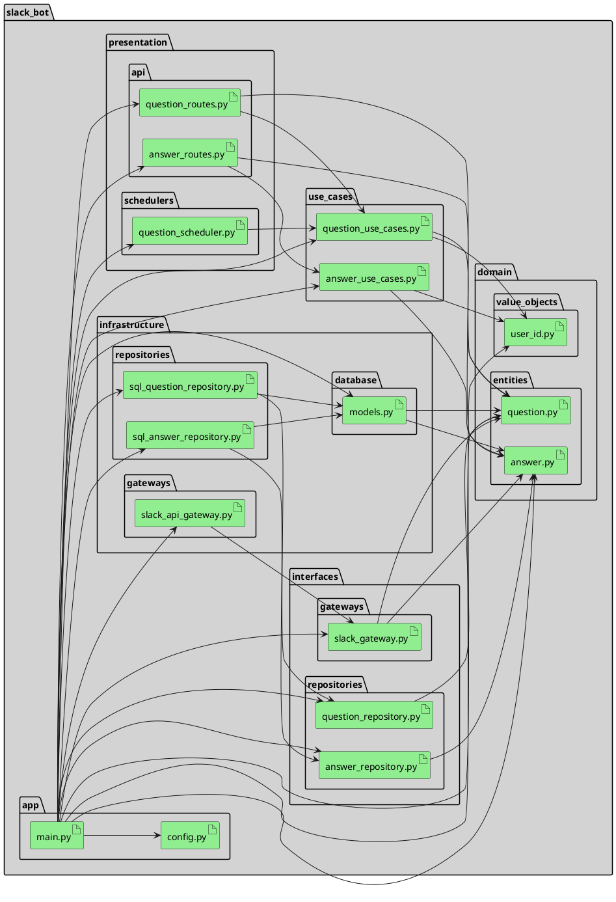

```plantuml
@startuml overview
left to right direction
'style
<style>
    folder {
        BackgroundColor lightGray
    }

    artifact {
        BackgroundColor LightGreen
    }

</style>


folder slack_bot {
    folder app {
        artifact "main.py" as main
        artifact "config.py" as config
    }

    folder domain {
        folder entities {
            artifact "question.py" as question
            artifact "answer.py" as answer
        }
        folder value_objects {
            artifact "user_id.py" as userId
        }
    }

    folder use_cases {
        artifact "question_use_cases.py" as questionUC
        artifact "answer_use_cases.py" as answerUC
    }

    folder interfaces {
        folder repositories {
            artifact "question_repository.py" as questionRepo
            artifact "answer_repository.py" as answerRepo
        }
        folder gateways {
            artifact "slack_gateway.py" as slackGateway
        }
    }

    folder infrastructure {
        folder database {
            artifact "models.py" as dbModels
        }
        folder repositories as infraRepositories {
            artifact "sql_question_repository.py" as sqlQuestionRepo
            artifact "sql_answer_repository.py" as sqlAnswerRepo
        }
        folder gateways as infraGateways {
            artifact "slack_api_gateway.py" as slackAPIGateway
        }
    }

    folder presentation {
        folder api {
            artifact "question_routes.py" as questionRoutes
            artifact "answer_routes.py" as answerRoutes
        }
        folder schedulers {
            artifact "question_scheduler.py" as questionScheduler
        }
    }
}

' 依存関係
main --> config
main --> question
main --> answer
main --> userId
main --> questionUC
main --> answerUC
main --> questionRepo
main --> answerRepo
main --> slackGateway
main --> dbModels
main --> sqlQuestionRepo
main --> sqlAnswerRepo
main --> slackAPIGateway
main --> questionRoutes
main --> answerRoutes
main --> questionScheduler

questionUC --> question
questionUC --> userId
answerUC --> answer
answerUC --> userId

questionRepo --> question
answerRepo --> answer
slackGateway --> question
slackGateway --> answer

dbModels --> question
dbModels --> answer

sqlQuestionRepo --> questionRepo
sqlQuestionRepo --> dbModels
sqlAnswerRepo --> answerRepo
sqlAnswerRepo --> dbModels
slackAPIGateway --> slackGateway

questionRoutes --> questionUC
questionRoutes --> question
answerRoutes --> answerUC
answerRoutes --> answer

questionScheduler --> questionUC

@enduml
```
